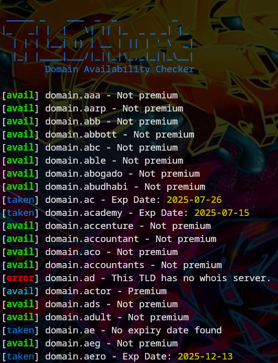

# TLDHunt - Domain Availability Checker
TLDHunt is a command-line tool designed to help users find available domain names for their online projects or businesses. By providing a list of keywords and a list of TLD (top-level domain) extensions, TLDHunt checks the availability of domain names that match the given criteria. This tool is particularly useful for those who want to quickly find a domain name that is not already taken, without having to perform a manual search on a domain registrar website.

For red teaming or phishing purposes, this tool can help you to find similar domains with different extensions from the original domain.

> [!NOTE]  
> Tested on: **Kali GNU/Linux Rolling** with **whois v5.5.15**
> Tested on: **Arch GNU/Linux** with **whois v5.5.23**

# Dependencies
This tool is written in Bash and the only dependency required is **whois**. Therefore, make sure that you have installed whois on your system. In Debian, you can install whois using the following command:
```
sudo apt install whois -y
```
In Arch:
```
sudo pacman -S whois
```

# How It Works?
To detect whether a domain is registered or not, we search for the words "**Name Server**", "**nserver**", "**nameservers**", or "**status: active**" in the output of the WHOIS command, as this is a signature of a registered domain (thanks to [Alex Matveenko](https://github.com/Alex-Matveenko) for the suggestion). 

If you have a better signature or detection method, please feel free to submit a pull request.

# Domain Extension List
For default Top Level Domain list (tlds.txt), we use data from https://data.iana.org.
You can use your custom list, but make sure that it is formatted like this:
```
.aero
.asia
.biz
.cat
.com
.coop
.info
.int
.jobs
.mobi
```

# How to Use
```
➜  TLDHunt ./tldhunt.sh
 _____ _    ___  _  _          _   
|_   _| |  |   \| || |_  _ _ _| |_ 
  | | | |__| |) | __ | || | ' \  _|
  |_| |____|___/|_||_|\_,_|_||_\__|
        Domain Availability Checker

Usage: ./tldhunt.sh [-k <keyword> | -K <keyword-file>] [-t <tld> | -T <tld-file>] [-d <time>] [-q] [-x] [-n] [-xn] [-h]

Options:
  -k,  --keyword             <keyword>       Specify a single keyword.
  -K,  --keyword-file        <file>          Use a file containing a list of keywords.
  -t,  --tld                 <tld>           Specify a single top-level domain (TLD).
  -T,  --tld-file            <file>          Use a file containing a list of TLDs.
  -d,  --delay               <time>          Set the delay time between requests. Default: 0.5s.
  -q,  --quiet                               Suppress error messages and display only results.
  -x,  --not-registered                      Show only unregistered domains.
  -n,  --no-premium                          Show only non-premium domains.
  -xn, --unreg-noprem                        Combination of -x and -n.
  -h,  --help                                Display this help message.

Examples:
  ./tldhunt.sh -K example.txt -t .com
  ./tldhunt.sh -k example -t .com
  ./tldhunt.sh -k example -T tlds.txt
  ./tldhunt.sh -k example -T tlds.txt -x
  ./tldhunt.sh -k example -T tlds.txt -n
  ./tldhunt.sh -k example -T tlds.txt -xn
  ./tldhunt.sh -k example -T tlds.txt -d 2
```
Example of TLDHunt usage:

Use default TLD list
```bash
./tldhunt.sh -k linuxsec -T tlds.txt
```
Use custom TLD list
```bash
./tldhunt.sh -k linuxsec -T custom-tld.txt
```
Use a list of keywords:
```bash
./tldhunt.sh -K linuxsec.txt -T .me
```
You can add `-d` or `--delay` set the **delay** time between requests. Default: 0.5s. Example:
```bash
./tldhunt.sh -k linuxsec -T tlds.txt -d 0.7
```
You can add `-q` or `--quiet` **suppress error** messages and display only results. Example:
```bash
./tldhunt.sh -k linuxsec -T tlds.txt -q
```
You can add `-x` or `--not-registered` flag to print only **not registered** domain. Example:
```bash
./tldhunt.sh -k linuxsec -T tlds.txt --not-registered
```
You can add `-n` or `--not-premium` flag to print only **available and not premium** domain. Example:
```bash
./tldhunt.sh -k linuxsec -T tlds.txt -n
```
You can add `-xn` or `-nx` or `--unreg-noprem` flag to print only **available and not premium and not registrar** domain. Example:
```bash
./tldhunt.sh -k linuxsec -T tlds.txt -xn
```
You can add `-h` or `--help` flag to print instruction. Example:
```bash
./tldhunt.sh -h
```
# Screenshot

# Note
If you see a lot of 'connect: Network is unreachable' errors, you have been blocked due to too many requests in a short period. Try again later and increase the delay.
